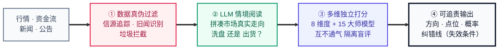
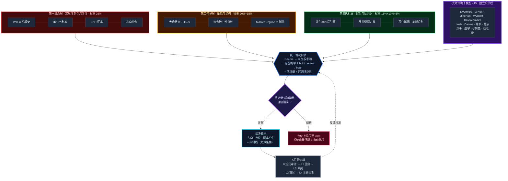
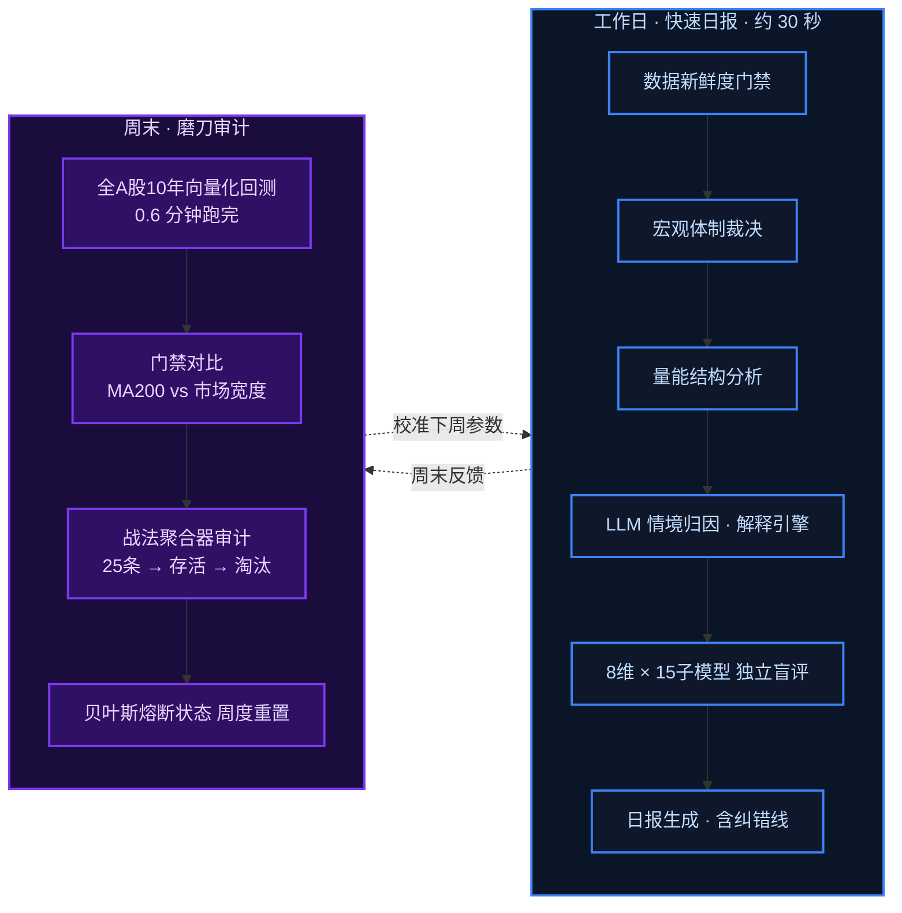

# 天眼 TianYan — 股市多维度判断多Agent系统

> A multi-agent, multi-dimensional verdict system for China A-shares — 8-dimension cross-validation, Bayesian cognitive circuit breaker, and falsifiable decision output.

## 设计理念

核心理念是一条**信息精炼管道**：让AI把海量原始信息变成可信的判断依据，再让多维裁决把判断变成可追责的建议。



## 为什么这样设计

源于个人投资中的三个真实痛点：

1. **消息不过滤就是毒药** — A股消息面充满标题党、旧闻重炒和刻意放风，未经真伪过滤直接喂给模型，推理越强错得越自信。所以把关必须在入口，不在出口；
2. **AI的投资建议不可追责** — 直接问LLM"某股票能不能买"，得到的回答自信、笼统、不可验证：错了无法追究哪一环错了，对了也无法复现。一个说不出"什么情况下我错了"的建议，等于没有建议；
3. **单一视角必然偏见、回测普遍说谎** — 看多时会选择性忽略利空，故用多维独立制衡且禁止互相商量；不剥离涨停不可成交与真实换手成本的回测数字全是幻觉（本项目曾解剖一个"年化+90%"的信号，加回真实约束后为年化-21.5%）。

因此本系统的目标**不是预测市场**，而是把投资决策改造成一个可审计的工程过程：每个结论可证伪（强制附带失效条件）、每个错误可追溯（预测留档+贝叶斯熔断自动降权）、每次改进可验证（隔离的回测实验室+五层验证塔）。它同时是作者在多Agent架构、LLM应用工程与量化验证方法论上的完整实践载体。

## 系统是什么

天眼不是"AI荐股工具"。它是一个**多Agent协同裁决系统**：让8个独立分析维度（宏观/大盘/景气/资金流/压力测试/反共识/盈亏/规则健康）+ 15个投资大师子模型各自独立打分，再由统一裁决引擎用连续化概率流合成结论——**每个结论必须附带可证伪的纠错线**，说不出"什么情况下我错了"的建议没有资格输出。

## 架构总览



## 与现有开源项目的关系

本项目不是从零发明，而是在调研并**实际使用**主流框架后，取其精华、针对其实测痛点重新设计：

| 项目 | 借鉴了什么 | 实测/观察到的问题 | 天眼的对应设计 |
|------|-----------|------------------|---------------|
| [TradingAgents](https://github.com/TauricResearch/TradingAgents) / [TradingAgents-CN](https://github.com/hsliuping/TradingAgents-CN)（93k/30k⭐） | 多Agent分工协作的总体范式 | 实际使用TradingAgents-CN的体验：单次分析LLM调用次数多、处理速度慢、成本高；辩论范式下**同样的输入每次运行结论不一致**——推理过程不可复现，意味着不可回测、不可追责 | ① 裁决核心为**确定性数学内核**（z-score→Φ加权→贝叶斯后验），同样输入必得同样输出，LLM的非确定性被隔离在裁决层之外；② LLM只用在必须情境理解的少数环节（新闻真伪过滤、情境判别），其余维度为量化规则，调用量低一个数量级；③ **独立盲评替代辩论**——本项目10周盲测中，辩论型角色被实测证伪为结构性偏空的"坏钟" |
| [ai-hedge-fund](https://github.com/virattt/ai-hedge-fund)（62k⭐） | 大师视角多元投票的思路 | 让LLM"扮演巴菲特"输出定性判断——人设式输出不可回测、不可复现 | 15个大师子模型为**规则化实现**（O'Neil市场状态机、Minervini趋势模板、Wyckoff吸筹派发等），可回测、可审计、错了可定位 |
| [qlib](https://github.com/microsoft/qlib) / [RD-Agent](https://github.com/microsoft/RD-Agent)（微软，46k/14k⭐） | 回测工程与研发自动化理念 | 通用平台，不含A股制度约束的诚实成本模型 | 回测引擎内置涨跌停不可成交剥离、真实换手成本、only-long重估 |

在此之上，天眼补上了全场缺席的一层：**可证伪输出协议**（结论强制带失效条件）、**贝叶斯认知熔断**（系统自我怀疑与自动降权）、**生产/实验室物理隔离**（未验证策略无投票权）。一句话概括差异：主流框架在追求让AI想得更像人（辩论、人设），本项目在追求**让AI的输出可审计**（确定性、可复现、可追责）。

## 核心设计决策（为什么这样设计）

### 1. 废除一票否决 → 权重投票
早期版本宏观维度拥有一票否决权，回测发现独裁者维度错一次代价极大。V8将宏观从"独裁者"降格为25%权重的"部长"，减仓需≥4个维度同意——**单一Agent再自信也不能推翻集体裁决**。

### 2. 多Agent独立盲评，不辩论到共识
多个分析Agent如果互相看到对方结论再"讨论"，会收敛成groupthink（从众放大而非纠错）。天眼的8个维度和15个大师子模型**彼此隔离独立打分**，只在裁决层合成；评审过程屏蔽P&L，防止"知道结果后编理由"。

### 3. 贝叶斯认知熔断 — Agent的自我怀疑机制
系统持续追踪自身预测的对错。连续错误→贝叶斯后验向50%（等于抛硬币）崩塌→自动触发熔断：最大仓位上限压至20%以下。**一个不知道自己何时不可信的系统，比一个平庸但诚实的系统更危险。**

### 4. 结论必须可证伪 — 纠错线
每个裁决强制输出格式：`操作 + 具体点位 + 概率分布(赚/亏/最坏) + 纠错线(跌破X或Y事件发生=我错了)`。没有纠错线的建议会被裁决引擎拒绝输出。

### 5. 卖出五重熔断（真实亏损事件驱动）
源自一次真实错误：技术面REJECT信号压过了历史级超卖+跨市场领先指标反向，卖出后标的暴涨。修复方式不是改参数，而是加结构：卖出信号必须过5重独立校验（超卖/传导/偏离/地缘/伪催化），3项不过=禁止卖出。

### 6. 诚实回测纪律 — 不粉饰，只做有逻辑支撑的改进
三版哑铃策略回测数据全保留，不删不改：

| 版本 | 改进点 | 年化 | 最大回撤 |
|------|--------|------|---------|
| V1 | 低PE+ROE防守 | -5.5% | -48.3% |
| V2 | 换低Beta+低波（地产陷阱教训） | -4.3% | -45.4% |
| V3 | +大盘趋势开关（熊市封印进攻） | -2.1% | -38.4% |

同期沪深300为-32%。每次迭代必须过三关：①有逻辑 ②有数据 ③能解释为什么有效。改进走新版本号保留旧版对照，禁止暗改参数美化夏普。另有铁律：**回测alpha必须先剥离涨跌停不可成交+真实换手成本再报数**——一个Sharpe 7.47的信号剥完真实约束后是年化-21.5%，这就是"回测漂亮实战一坨"的完整解剖。

### 7. 数据不过夜
任何市场结论输出前，强制检查本地DuckDB最新K线日期；数据≠今天→先刷新再开口。用过期数据出结论=直接违规拦截。

## 模块地图

| 模块 | 文件 | 说明 |
|------|------|------|
| CLI总入口 | [tianyan.py](tianyan.py) | 40+子命令：daily/full/recommend/backtest/... |
| 统一裁决引擎 | [engine/unified_verdict.py](engine/unified_verdict.py) | 三层金字塔+8维矩阵+连续化概率流 |
| 概率数学内核 | [engine/verdict_math.py](engine/verdict_math.py) | z-score→Φ加权→后验概率→迟滞环 |
| 侦探推理引擎 | [detective_engine.py](detective_engine.py) | 四阶段递归推理+自检验闭环（读昨日预测→对比今日→标记漏报） |
| 日报调度器 | [engine/report_orchestrator.py](engine/report_orchestrator.py) | 39模块编排→Markdown日报 |
| 贝叶斯熔断 | [engine/fuse_breaker.py](engine/fuse_breaker.py) | 卖出五重校验+分级熔断 |
| 大师子模型 | [engine/sub_models/](engine/sub_models/) | Livermore/O'Neil/Minervini/Wyckoff等15个独立投票器 |
| 蒂尔滤网 | [engine/thiel_filter.py](engine/thiel_filter.py) | 彼得·蒂尔四问：垄断→秘密→时机→反共识致命Bug |
| 压力测试 | [engine/scenario_engine.py](engine/scenario_engine.py) | 5场景情景推演+黑天鹅 |
| 反共识引擎 | [engine/anti_consensus_prosperity.py](engine/anti_consensus_prosperity.py) | 景气度剪刀差（带RSI+涨幅门禁，防"反共识陷阱"） |
| 资金流指纹 | [engine/capital_flow_fingerprint.py](engine/capital_flow_fingerprint.py) | 微观结构五维指纹 |
| 规则健康监控 | [engine/rule_failure_early_warning.py](engine/rule_failure_early_warning.py) | CuSum+滚动窗口，规则失效预警 |
| 五层验证塔 | [engine/verification_tower.py](engine/verification_tower.py) | L0规则审计→L1回测→L2矛盾→L3盲区→L4生命周期 |
| LLM情境判别 | [engine/national_team_backstop.py](engine/national_team_backstop.py) | LLM动态辨别国家队护盘（情境整合，非阈值规则） |
| 回测实验室 | [engine/backtest_v8_atr_fast.py](engine/backtest_v8_atr_fast.py) 等 | 全A股10年向量化回测(0.6分钟)+门禁对比+ATR定仓+纸交 |

## 生产/实验室两阶段工作流



```
工作日: python tianyan.py full        → V8生产日报（30秒，读周末校准缓存）
周末:   python engine/backtest_v8_atr_fast.py + run_weekend_audit.py
        → 全A股回测 + 战法审计 + 贝叶斯状态重置（磨刀）
```

新战法一律先进回测实验室（战法聚合→四重门→纸交全链验证），存活才接入生产投票——**生产系统和实验环境物理隔离，防止未验证信号污染实盘裁决**。

## 运行说明

本仓库为**架构与核心引擎展示**。完整运行依赖本地数据基础设施（DuckDB行情库、分钟级历史数据、新闻采集管道），数据文件不随仓库分发。

```bash
pip install -r requirements.txt
# 需自备: DuckDB行情库(kline_daily/macro_indicators等表) + portfolio.json(持仓配置)
python tianyan.py market      # 市场面全景
python tianyan.py recommend   # 统一建议引擎
```

## 免责声明

本项目为个人研究与工程实践，所有输出仅为概率分析，不构成投资建议。买卖决策权在使用者，分析责任在系统——这本身也是系统的设计原则之一（Agent不替人按按钮）。

## License

MIT
