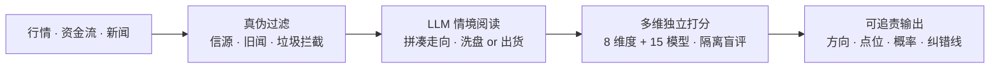
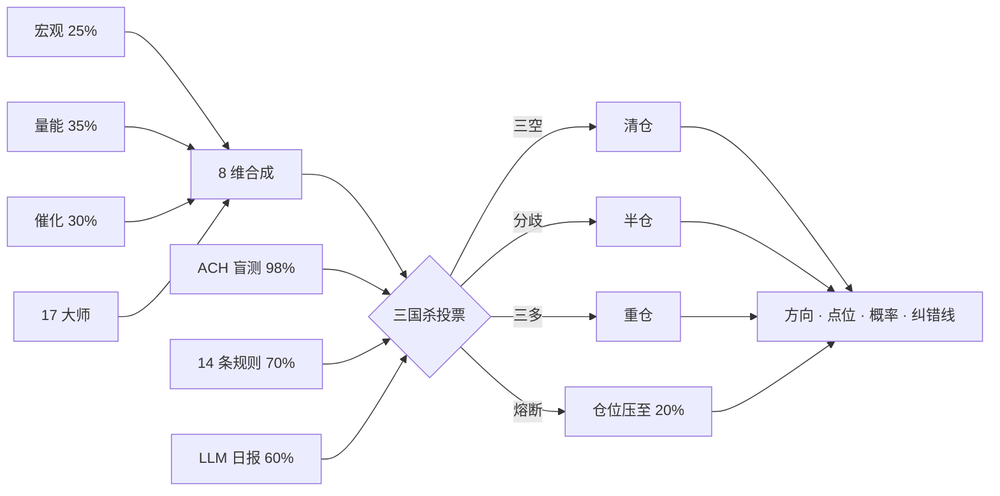
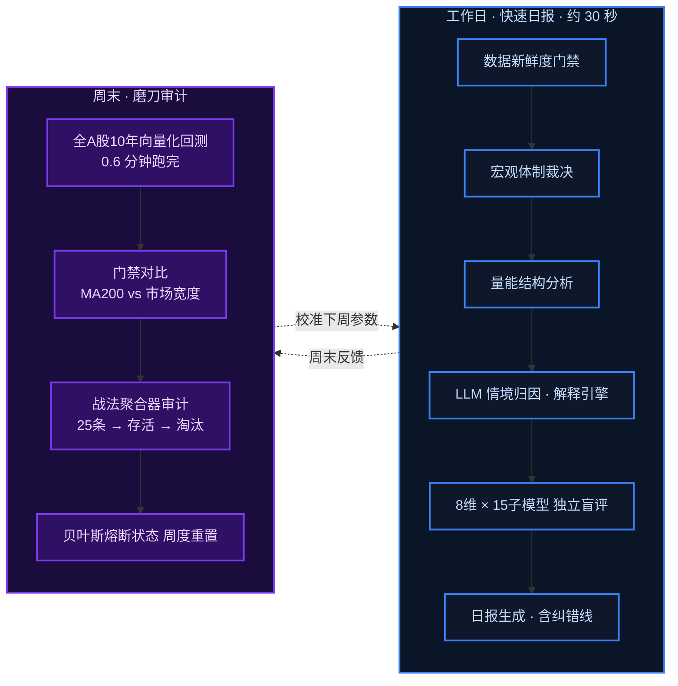

# 天眼 · TianYan

### 股市多维度判断 · 多 Agent 系统

[](https://www.python.org/)
[](.)
[](./engine/)
[](./LICENSE)
[](.)

---

> **核心命题** — 把 AI 对股市的分析改造成可审计的工程过程
>
> 8 维独立盲评 · 15 子模型投票 · 18 维预测 · ACH 多假设推理 · LLM 情境归因 · 贝叶斯熔断 · 三方盲测

---

## 设计理念

核心理念是一条**信息精炼管道**：让AI把海量原始信息变成可信的判断依据，再让多维裁决把判断变成可追责的建议。



## 为什么这样设计

源于个人投资中的三个真实痛点：

1. **消息不过滤就是毒药** — A股消息面充满标题党、旧闻重炒和刻意放风，未经真伪过滤直接喂给模型，推理越强错得越自信。所以把关必须在入口，不在出口；
2. **AI的投资建议不可追责** — 直接问LLM"某股票能不能买"，得到的回答自信、笼统、不可验证：错了无法追究哪一环错了，对了也无法复现。一个说不出"什么情况下我错了"的建议，等于没有建议；
3. **单一视角必然偏见、回测普遍说谎** — 看多时会选择性忽略利空，故用多维独立制衡且禁止互相商量；不剥离涨停不可成交与真实换手成本的回测数字全是幻觉（本项目曾解剖一个"年化+90%"的信号，加回真实约束后为年化-21.5%）。

因此本系统的目标**不是预测市场**，而是把投资决策改造成一个可审计的工程过程：每个结论可证伪（强制附带失效条件）、每个错误可追溯（预测留档+贝叶斯熔断自动降权）、每次改进可验证（隔离的回测实验室+五层验证塔）。它同时是作者在多Agent架构、LLM应用工程与量化验证方法论上的完整实践载体。

## 系统是什么

天眼是一套**多Agent协同裁决系统**，分两步走：第一步，8 个独立分析维度 + 17 个大师子模型各自独立打分（互不通气）；第二步，三国杀三套独立系统交叉验证（ACH 盲测 98% / 14 条规则 70% / LLM 日报 60%）投票决定方向。LLM 在本系统中**不决策**——它只把天眼的结构化数据翻译成人话，投票权仅 60%，是三国杀里最低的一张票。任何裁决必须附带可证伪的纠错线，否则被引擎拒绝输出。

---

| `22,000+` 行 Python | `71` 引擎模块 | `8` 裁决维度 | `17` 独立子模型 | `18` 预测通道 | `6` 层 ACH 推理 | `3` 方盲测基线 |
|:---:|:---:|:---:|:---:|:---:|:---:|:---:|

---

## 架构总览 — 以风控为核心的裁决管道

> 这套系统的目标**不是预测市场**。它是防蠢系统：两道裁决串行（8 维定方向 → 三国杀定仓位），任何单一系统的错误不会绑架全局。保险丝不发电，但它防止火灾。



## 系统架构全景

天眼 V8 是一个完整的多 Agent 裁决系统，当前代码规模约 **22,000 行 Python**，由四条主线构成：

### 一、信息精炼管道（生产主线）

从原始数据到可追责建议的四道工序：

| 工序 | 模块 | 行数 | 职责 |
|------|------|------|------|
| **① 数据过滤** | `data_guard.py` `data_availability.py` `data_fallback.py` `rss_collector.py` `news_collector.py` | ~2,400 | 多源降级采集 + 新鲜度门禁 + 信源追踪 + 旧闻重炒识别 |
| **② 情境归因** | `context_reader.py` `national_team_backstop.py` `news_hub.py` `event_calendar.py` | ~3,000 | LLM 解释引擎：多假设竞争 + 可证伪 + 编造钓鱼校验；国家队护盘动态判别；消息能量模型 |
| **③ 多维打分** | `unified_verdict.py` `verdict_math.py` `market_regime.py` `capital_flow_fingerprint.py` + 17 个子模型 | ~10,000 | 8 维 + 15 大师独立盲评，z-score → Φ 加权 → 贝叶斯后验 → 迟滞环 |
| **④ 可追责输出** | `unified_verdict.py` `report_orchestrator.py` `fuse_breaker.py` | ~5,000 | 日报生成 + 纠错线强制 + 卖出五重熔断 + 贝叶斯认知熔断 |

### 二、8 维度交叉验证矩阵

每个维度独立打分，仅在裁决层合成（权重来源：V8 架构设计决策）：

| # | 维度 | 核心模块 | 权重 | 关键机制 |
|---|------|---------|------|---------|
| 1 | **宏观体制** | `market_regime.py` `cross_market_conduction.py` `national_team_backstop.py` | 25% | WTI 双维框架（绝对价格+涨速）、美10Y+CNH 传导矩阵、国家队护盘 LLM 判别 |
| 2 | **大盘状态** | `market_regime.py` `constitution.py` | 20% | O'Neil 市场阶段 + Market Regime 四象限（广度+轮动烈度） |
| 3 | **景气度** | `anti_consensus_prosperity.py` | 15% | 四层引擎选股 + 反共识剪刀差（带 RSI 门禁防陷阱） |
| 4 | **资金流** | `capital_flow_fingerprint.py` | 15% | 五维指纹（北向/主力/散户/融资/大单方向+强度+持续性） |
| 5 | **盈亏** | `unified_verdict.py` 内置 | 10% | 持仓实时盈亏纳入风险偏好修正 |
| 6 | **压力测试** | `scenario_engine.py` `black_swan.py` `risk_controller.py` | 10% | 5 情景推演（基线/衰退/危机/黑天鹅/政策冲击） |
| 7 | **反共识** | `thiel_filter.py` | 10% | 蒂尔四问滤网——垄断→秘密→时机→致命 Bug |
| 8 | **规则健康** | `rule_failure_early_warning.py` `rule_audit.py` | 5% | CuSum + 滚动窗口；规则失效预警；矛盾/重叠/盲区三检 |

### 三、大师策略子模型 ×17

独立投票器——规则化实现，非 LLM 人设扮演（可回测、可审计）：

> **国际派**：Livermore（关键点反转）· O'Neil（CAN SLIM 状态机）· Minervini（趋势模板）· Wyckoff（吸筹派发区）· Druckenmiller（宏观先行）· Loeb（成交量确认）· Darvas（箱体突破）
>
> **A 股派**：养家（情绪周期）· 北京炒手（地量窒息底）· 退学（超短打板）· 小鳄鱼（龙头接力）· 徐翔（涨停板战法）· 赵老哥（游资跟随）· 乔帮主（低吸）· 逻辑哥（事件驱动）

### 四、风控与验证层

| 层级 | 模块 | 机制 |
|------|------|------|
| **三国杀交叉验证** | ACH 盲测 + 14 条规则 + LLM 日报 | 三系统独立投票：全空=清仓、全多=重仓、分歧=半仓 |
| **福尔摩斯追问** | 信源追溯 + 旧闻识别 + 名实背离 | 每条消息默认是假的，直到被独立通道确认 |
| **贝叶斯认知熔断** | `unified_verdict.py` 内置 | 连续错误 → 后验崩塌至 50% → 仓位上限自动压至 20% |
| **卖出五重熔断** | `fuse_breaker.py` | 超卖 / 传导 / 偏离 / 地缘 / 伪催化——3 项不过 = 禁止卖出 |
| **五层验证塔** | `verification_tower.py` `conflict_resolver.py` `strategy_lifecycle.py` | L0 规则审计 → L1 回测 → L2 冲突 → L3 盲区 → L4 生命周期 |
| **诚实回测** | `backtest_v8.py` `backtest_gate.py` `backtest_monitor.py` | 涨跌停剥除 + 真实换手成本 + only-long 重估 + Purged CV |
| **纸交引擎** | `paper_trade.py` `portfolio_referee.py` | 先卖后买双向执行；真实费率滑点；Perold 实施差额基准 |

### 五、生产 / 实验物理隔离

生产与实验室**代码隔离、状态不共享**——未通过全链路验证的策略不允许接入生产投票：

```
生产系统：tianyan.py full → 日报 30 秒                        实验室（lab/ 100+ 脚本）：
  ├─ 8 维裁决                                          ├─ attack_engine v2-v11（进攻引擎）
  ├─ 自动日报管道（cron 无人值守）                        ├─ Holmes v1-v9（侦探系列）
  └─ 实时风控                                           ├─ 噪音研究（noise_topology / noise_thermometer）
                                                       ├─ 微观结构（microstructure / orderflow）
                                                       ├─ 因子挖掘（alpha101 / cross_section / 非线性审计）
                                                       └─ 同步指纹（sync_expand / triangle）
```

### 六、基础设施

| 组件 | 模块 | 说明 |
|------|------|------|
| CLI 总入口 | `tianyan.py` | 40+ 子命令（daily / full / recommend / backtest / attack / ...） |
| 数据底座 | DuckDB `finance.db` | 全 A 股日线 + 分钟线 + 宏观 + 资金流 + 新闻 |
| MCP 服务 | `mcp_server/` | 对外 API，供 AI Agent 直接调用天眼裁决能力 |
| 侦探推理 | `detective_engine.py` | 四阶段递归推理 + 自检验闭环（读昨日预测→对比今日→标记漏报） |
| 跨市场传导 | `cross_market_conduction.py` | 时滞矩阵——原油→有色、美债→成长、CNH→北向 |

## 与现有开源项目的关系

本项目不是从零发明，而是在调研并**实际使用**主流框架后，取其精华、针对其实测痛点重新设计：

| 项目 | 借鉴了什么 | 实测/观察到的问题 | 天眼的对应设计 |
|------|-----------|------------------|---------------|
| [TradingAgents](https://github.com/TauricResearch/TradingAgents) / [TradingAgents-CN](https://github.com/hsliuping/TradingAgents-CN)（93k/30k⭐） | 多Agent分工协作的总体范式 | 实际使用TradingAgents-CN的体验：单次分析LLM调用次数多、处理速度慢、成本高；辩论范式下**同样的输入每次运行结论不一致**——推理过程不可复现，意味着不可回测、不可追责 | ① 裁决核心为**确定性数学内核**（z-score→Φ加权→贝叶斯后验），同样输入必得同样输出，LLM的非确定性被隔离在裁决层之外；② LLM只用在必须情境理解的少数环节（新闻真伪过滤、情境判别），其余维度为量化规则，调用量低一个数量级；③ **独立盲评替代辩论**——本项目10周盲测中，辩论型角色被实测证伪为结构性偏空的"坏钟" |
| [ai-hedge-fund](https://github.com/virattt/ai-hedge-fund)（62k⭐） | 大师视角多元投票的思路 | 让LLM"扮演巴菲特"输出定性判断——人设式输出不可回测、不可复现 | 15个大师子模型为**规则化实现**（O'Neil市场状态机、Minervini趋势模板、Wyckoff吸筹派发等），可回测、可审计、错了可定位 |
| [qlib](https://github.com/microsoft/qlib) / [RD-Agent](https://github.com/microsoft/RD-Agent)（微软，46k/14k⭐） | 回测工程与研发自动化理念 | 通用平台，不含A股制度约束的诚实成本模型 | 回测引擎内置涨跌停不可成交剥离、真实换手成本、only-long重估 |

在此之上，天眼补上了全场缺席的三层：

1. **三国杀交叉验证** — ACH 盲测（纯统计 98%）+ 14 条规则（纯规则 70%）+ LLM 日报（60%），三系统独立投票，LLM 权重最低只算参考票；三空=清仓、三多=重仓、分歧=半仓
2. **福尔摩斯追问机制** — 不能盲信消息：信源追溯 → 旧闻重炒识别 → 名实背离检测，未经交叉验证的消息默认当作假的
3. **可证伪输出 + 认知熔断 + 物理隔离** — 结论强制带失效条件、系统自我怀疑自动降权、未验证策略无投票权

一句话概括差异：主流框架在追求让AI想得更像人（辩论、人设），本项目在追求**让AI的输出可审计**（确定性、可复现、可追责）。

## 裁决体系与 LLM 的真实作用

### LLM 只做一件事：把数据翻译成人话

LLM 不看原始数据，不跑回测，不算概率。它的唯一职责是**读天眼给的结构化数据摘要，写成一段通顺的中文研判**。研究结论（拥挤反转、恐慌底、尾盘陷阱等）通过 system prompt 注入，LLM 只是叙述者。

### 三国杀交叉验证 —— 三套独立系统投票

最终的买卖方向不由 LLM 决定，由三个完全独立的系统投票裁决：

| 投票系统 | 数据源 | 权重 | 性质 |
|---------|------|:--:|------|
| **ACH 盲测** | `blindtest_v4.db` 历史统计 · 43 只股票逐日打分 | **98%** | 纯统计 · 无 LLM |
| **14 条规则** | 周几效应 · 拥挤反转 · 恐慌底等实证规则 | **70%** | 纯规则 · 无 LLM |
| **LLM 日报** | 福尔摩斯日报的偏空/偏多关键词 | **60%** | LLM 辅助 · 参考票 |

**权重逻辑：纯数据 > 纯规则 > LLM 辅助。LLM 是参考票，不是决定票。**

### 福尔摩斯追问机制 —— 不能盲信消息

新闻和消息不是直接喂给 LLM 的。福尔摩斯在阅读每条消息时会追问三轮：

1. **信源追溯** — 这条消息来自哪？官方公告 / 权威媒体 / 自媒体 / 不可溯源？不可溯源且无交叉印证的消息只能标"待验传闻"
2. **旧闻重炒识别** — 三天前的利好改个标题重发？对比历史消息列表，旧闻直接剔除
3. **名实背离检测** — 标题写"重大利好"但内容是减持套现？同一消息在恐慌盘和亢奋盘中含义完全不同，必须结合盘面情境判读

福尔摩斯不信任任何单条消息。它的默认预设是：**每一条未经交叉验证的消息都是假的，直到被至少一个独立通道确认。**

### 仓位裁决

```
三系统全空  →  清仓 / 轻仓                    高置信度
三系统全多  →  重仓                           高置信度
分歧       →  半仓 + 主线板块                  降仓等信号
```

三层裁决全部运行结束后，李大霄独立判决——基于以上全部数据 + 当前持仓 + 纠错线，输出最终操盘计划。

## 核心设计决策（为什么这样设计）

### 1. 两层裁决：8 维盲评 + 三国杀交叉验证
第一道是 8 维独立盲评（宏观从一票否决降格为 25% 权重部长）。第二道是三国杀——ACH 盲测（98%）+ 14 条规则（70%）+ LLM 日报（60%）三套独立系统投票。两道裁决串行：8 维定仓位方向，三国杀定仓位尺寸。**单一 Agent 再自信也不能推翻集体裁决，LLM 只是三国杀里权重最低的参考票。**

### 2. 多Agent独立盲评，不辩论到共识
多个分析Agent如果互相看到对方结论再"讨论"，会收敛成groupthink（从众放大而非纠错）。天眼的8个维度和15个大师子模型**彼此隔离独立打分**，只在裁决层合成；评审过程屏蔽P&L，防止"知道结果后编理由"。

### 3. 贝叶斯认知熔断 — Agent的自我怀疑机制
系统持续追踪自身预测的对错。连续错误→贝叶斯后验向50%（等于抛硬币）崩塌→自动触发熔断：最大仓位上限压至20%以下。**一个不知道自己何时不可信的系统，比一个平庸但诚实的系统更危险。**

### 4. 结论必须可证伪 — 纠错线
每个裁决强制输出格式：`操作 + 具体点位 + 概率分布(赚/亏/最坏) + 纠错线(跌破X或Y事件发生=我错了)`。没有纠错线的建议会被裁决引擎拒绝输出。

### 5. 卖出五重熔断（真实亏损事件驱动）
源自一次真实错误：技术面REJECT信号压过了历史级超卖+跨市场领先指标反向，卖出后标的暴涨。修复方式不是改参数，而是加结构：卖出信号必须过5重独立校验（超卖/传导/偏离/地缘/伪催化），3项不过=禁止卖出。

### 6. 诚实回测纪律 — 不粉饰，只做有逻辑支撑的改进
三版哑铃策略回测数据全保留，不删不改：

| 版本 | 改进点 | 年化 | 最大回撤 |
|------|--------|------|---------|
| V1 | 低PE+ROE防守 | -5.5% | -48.3% |
| V2 | 换低Beta+低波（地产陷阱教训） | -4.3% | -45.4% |
| V3 | +大盘趋势开关（熊市封印进攻） | -2.1% | -38.4% |

同期沪深300为-32%。每次迭代必须过三关：①有逻辑 ②有数据 ③能解释为什么有效。改进走新版本号保留旧版对照，禁止暗改参数美化夏普。另有铁律：**回测alpha必须先剥离涨跌停不可成交+真实换手成本再报数**——一个Sharpe 7.47的信号剥完真实约束后是年化-21.5%，这就是"回测漂亮实战一坨"的完整解剖。

### 7. 数据不过夜
任何市场结论输出前，强制检查本地DuckDB最新K线日期；数据≠今天→先刷新再开口。用过期数据出结论=直接违规拦截。

## 核心模块文件索引

> 完整架构见上方「系统架构全景」。以下为仓库内对应文件。

| 层级 | 文件 |
|------|------|
| CLI 总入口 | [tianyan.py](tianyan.py) |
| 统一裁决引擎 | [engine/unified_verdict.py](engine/unified_verdict.py)（2,456 行） |
| LLM 解释引擎 | [engine/context_reader.py](engine/context_reader.py)（316 行 · 2026-07 新增） |
| 概率数学内核 | [engine/verdict_math.py](engine/verdict_math.py)（630 行） |
| 侦探推理引擎 | [detective_engine.py](detective_engine.py)（8,157 行） |
| 日报调度器 | [engine/report_orchestrator.py](engine/report_orchestrator.py)（1,958 行） |
| 大师策略子模型 | [engine/sub_models/](engine/sub_models/)（17 个，1,355 行） |
| 回测实验室 | [engine/backtest_v8.py](engine/backtest_v8.py) · [engine/backtest_gate.py](engine/backtest_gate.py) · [engine/backtest_monitor.py](engine/backtest_monitor.py) |
| 数据基础设施 | [engine/data_guard.py](engine/data_guard.py) · [engine/data_availability.py](engine/data_availability.py) · [engine/data_fallback.py](engine/data_fallback.py) |

## 生产 / 实验室两阶段工作流



```
工作日: python tianyan.py full        → V8生产日报（30秒，读周末校准缓存）
周末:   python engine/backtest_v8_atr_fast.py + run_weekend_audit.py
        → 全A股回测 + 战法审计 + 贝叶斯状态重置（磨刀）
```

新战法一律先进回测实验室（战法聚合→四重门→纸交全链验证），存活才接入生产投票——**生产系统和实验环境物理隔离，防止未验证信号污染实盘裁决**。

## 运行说明

本仓库为**架构与核心引擎展示**。完整运行依赖本地数据基础设施（DuckDB行情库、分钟级历史数据、新闻采集管道），数据文件不随仓库分发。

```bash
pip install -r requirements.txt
# 需自备: DuckDB行情库(kline_daily/macro_indicators等表) + portfolio.json(持仓配置)
python tianyan.py market      # 市场面全景
python tianyan.py recommend   # 统一建议引擎
```

## 免责声明

本项目为个人研究与工程实践，所有输出仅为概率分析，不构成投资建议。买卖决策权在使用者，分析责任在系统——这本身也是系统的设计原则之一（Agent不替人按按钮）。

## License

MIT
